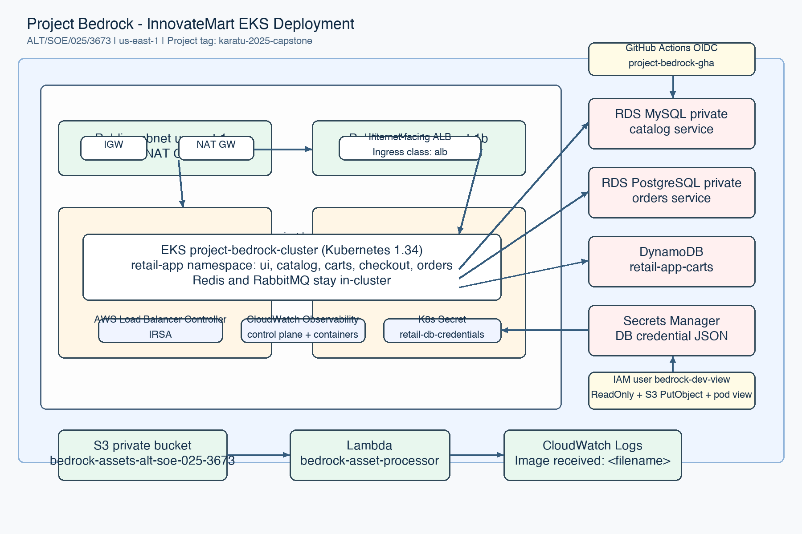

# Project Bedrock

AltSchool Cloud Engineering Karatu 2025 Third Semester Month 4 Capstone: InnovateMart's Inaugural EKS Deployment.

Student ID: `ALT/SOE/025/3673`

## Project Overview

Project Bedrock deploys the AWS Retail Store Sample App on Amazon EKS in `us-east-1`. Infrastructure is provisioned with Terraform and includes a tagged VPC, private managed node group, public ALB ingress, managed AWS data services, S3 event processing with Lambda, CloudWatch logging, a restricted developer IAM user and GitHub Actions deployment workflows.

Required fixed values:

- EKS cluster: `project-bedrock-cluster`
- VPC `Name` tag: `project-bedrock-vpc`
- Kubernetes namespace: `retail-app`
- IAM developer user: `bedrock-dev-view`
- Lambda function: `bedrock-asset-processor`
- Required tag: `Project = karatu-2025-capstone`
- Assets bucket: `bedrock-assets-alt-soe-025-3673`

The capstone brief describes the assets bucket as `bedrock-assets-[student-id]`. S3 bucket names must be lowercase, so `ALT/SOE/025/3673` is normalised to `alt-soe-025-3673`.

## Architecture



The architecture uses a two-AZ VPC with public and private subnets. Public subnets host the internet-facing ALB and a single NAT Gateway. Private subnets host EKS managed worker nodes and private RDS MySQL/PostgreSQL databases. The retail app runs in `retail-app`, with catalog using RDS MySQL, orders using RDS PostgreSQL, carts using DynamoDB, and Redis/RabbitMQ staying in-cluster. S3 object uploads invoke `bedrock-asset-processor`, which logs `Image received: <filename>` to CloudWatch.

## Prerequisites

- AWS account with permissions to create VPC, EKS, RDS, DynamoDB, S3, Lambda, IAM and CloudWatch resources
- Terraform `>= 1.10`
- AWS CLI v2
- `kubectl`
- `helm`
- GitHub repository for CI/CD

Set your AWS identity locally before deployment:

```sh
aws sts get-caller-identity
aws configure set region us-east-1
```

## Backend Setup

Create the remote state bucket first:

```sh
cd bootstrap
terraform init
terraform apply
```

This creates `bedrock-tfstate-alt-soe-025-3673` with versioning, SSE and public access blocked. The main Terraform stack then uses S3 native lock files.

## Terraform Deployment

Copy the example variables and update the GitHub repository and allowed EKS API CIDR:

```sh
cd ../terraform
cp terraform.tfvars.example terraform.tfvars
```

Edit `terraform.tfvars` with safe values only. Do not commit `terraform.tfvars`.

Deploy:

```sh
terraform init
terraform fmt -recursive
terraform validate
terraform plan
terraform apply
```

If the first full apply reaches the cluster before Kubernetes providers can connect, rerun `terraform apply`. The infrastructure is declared in one stack, but EKS API readiness can lag the AWS resource state.

## Kubernetes Deployment

After Terraform apply:

```sh
aws eks update-kubeconfig --region us-east-1 --name project-bedrock-cluster
kubectl get ns retail-app
kubectl get pods -n retail-app
kubectl get ingress -n retail-app
```

Terraform installs the AWS Load Balancer Controller and AWS Retail Store Sample App Helm releases. The Helm values are in `helm/values-retail-app.yaml`; passwords are not committed and are supplied through the Terraform-managed `retail-db-credentials` Kubernetes Secret.

## CI/CD Usage

The Terraform stack creates a GitHub OIDC role named `project-bedrock-gha`. In GitHub, set repository variable `AWS_ROLE_ARN` to the `github_actions_role_arn` Terraform output.

- Pull requests run `terraform fmt -check`, `terraform init`, `terraform validate`, `terraform plan`, then post the plan as a PR comment.
- Pushes to `main` run `terraform plan`, reject plans containing delete actions, then apply behind the `production` environment gate.
- CI never runs `terraform destroy`.

## Verification Commands

See `docs/verification.md` for the full checklist. Key checks:

```sh
aws eks describe-cluster --region us-east-1 --name project-bedrock-cluster
aws ec2 describe-vpcs --region us-east-1 --filters Name=tag:Name,Values=project-bedrock-vpc
aws s3api head-bucket --bucket bedrock-assets-alt-soe-025-3673
aws lambda get-function --region us-east-1 --function-name bedrock-asset-processor
kubectl get pods -n retail-app
kubectl get ingress -n retail-app
```

## Grading Credentials Placeholder

After apply, retrieve the `bedrock-dev-view` credentials from sensitive Terraform outputs:

```sh
cd terraform
terraform output -raw developer_access_key_id
terraform output -raw developer_secret_access_key
terraform output -raw developer_console_password
```

Do not paste these values into source files, issues, logs or documentation.

Bucket note for grading: the required bucket stem is preserved, but the final bucket is lowercase: `bedrock-assets-alt-soe-025-3673`.

## Application URL Placeholder

Fill this after the ALB is provisioned:

```text
http://<alb-dns-name>
```

Find it with:

```sh
kubectl get ingress -n retail-app
```

## Cost Warning

This stack creates billable resources: EKS control plane, two EC2 worker nodes, NAT Gateway, ALB, two RDS databases, CloudWatch logs and S3/Lambda usage. Expect roughly `8-15 USD/day` if left running. Destroy when grading is complete.

## Teardown

Remove Kubernetes load balancers first so VPC deletion is not blocked:

```sh
cd terraform
terraform destroy -target=helm_release.ui
terraform destroy -target=helm_release.checkout
terraform destroy -target=helm_release.orders
terraform destroy -target=helm_release.carts
terraform destroy -target=helm_release.catalog
terraform destroy -target=helm_release.aws_load_balancer_controller
```

Empty S3 buckets if required, then destroy the main stack and bootstrap last:

```sh
terraform destroy
cd ../bootstrap
terraform destroy
```

## Generate `grading.json`

After successful deployment:

```sh
cd terraform
terraform output -json | jq 'with_entries(select(.key | IN("cluster_endpoint","cluster_name","region","vpc_id","assets_bucket_name")))' > ../grading.json
```

The root outputs include `cluster_endpoint`, `cluster_name`, `region`, `vpc_id` and `assets_bucket_name`.
